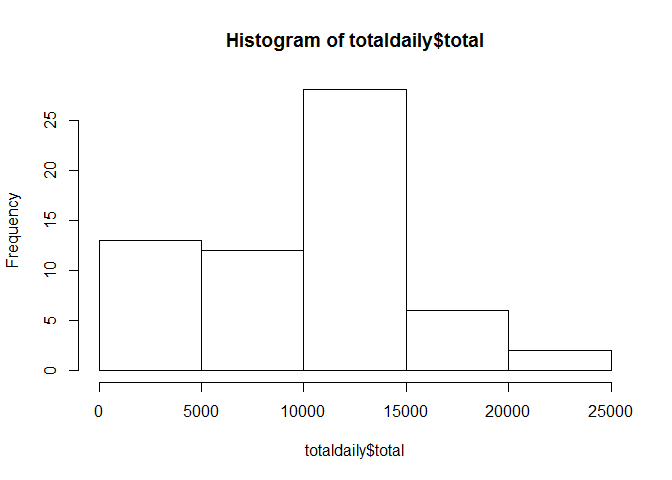
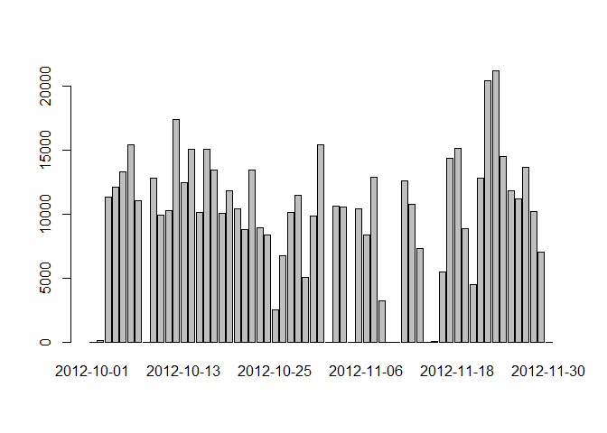
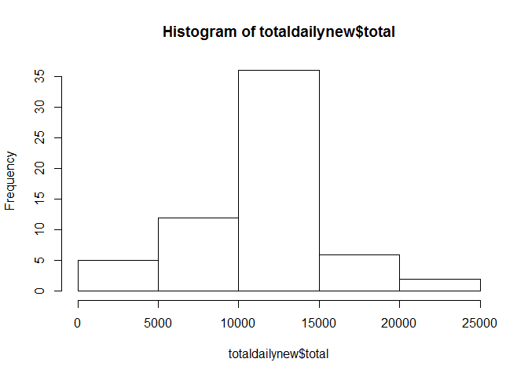
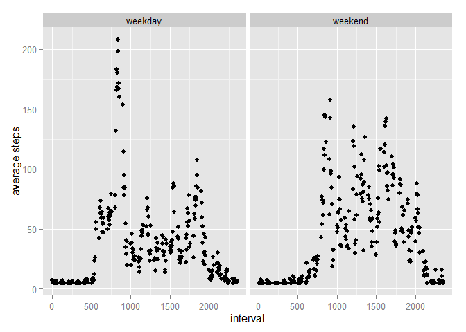

# Reproducible Research: Peer Assessment 1


## Loading and preprocessing the data
1. First unzip the file and move it to current folder  
1. Make sure the current directory is set correctly  
1. Load the activity data  

```r
setwd("~/Coursera/RepData_PeerAssessment1")
rawdata <- read.csv("./activity.csv")
```


## What is mean total number of steps taken per day?
1. Make a histogram of the total number of steps taken each day

```r
totaldaily <- aggregate(list(total=rawdata$steps), list(date = rawdata$date), FUN=sum, na.rm=TRUE)
hist(totaldaily$total)
```

 
  
  You can also check total per day by plotting


```r
barplot(totaldaily$total, names.arg=totaldaily$date)
```

 

2. Calculate and report the mean and median total number of steps taken per day

```r
totaldailyMean =mean(totaldaily$total, na.rm=TRUE)
totaldailyMedian = median(totaldaily$total, na.rm=TRUE)
```
  
  The mean of total number of steps taken per day is 9354.2295082  
  The median of total number of steps taken per day is 10395
  
## What is the average daily activity pattern?

1. Make a time series plot (i.e. type = "l") of the 5-minute interval (x-axis) and the average number of steps taken, averaged across all days (y-axis)


```r
 avgAcrossDays <- aggregate(list(avg=rawdata$steps), list(interval = rawdata$interval), FUN=mean, na.rm=TRUE)
 plot(avgAcrossDays$interval, avgAcrossDays$avg, type="l", xlab="Interval", ylab="Average Steps")
```

 
 
2. Which 5-minute interval, on average across all the days in the dataset, contains the maximum number of steps?


```r
maxInterval <- avgAcrossDays[which.max( avgAcrossDays[,2]),1]
```

  The interval:835 contains the maximum number of steps
  
## Imputing missing values

1.Calculate and report the total number of missing values in the dataset (i.e. the total number of rows with NAs)  


```r
missing <- nrow(rawdata[is.na(rawdata$steps),])
```

  2304 total NAs exist!
  
2. Devise a strategy for filling in all of the missing values in the dataset. The strategy does not need to be sophisticated. For example, you could use the mean/median for that day, or the mean for that 5-minute interval, etc.


```r
##Use average daily to fill the missing values, if all NA's for that day, use average across all days
avgdaily <- aggregate(list(avg=rawdata$steps), list(date = rawdata$date), FUN=mean, na.rm=FALSE)
avgdaily[is.na(avgdaily$avg),2] <- mean(rawdata$steps, na.rm=TRUE)
```
  
  
3. Create a new dataset that is equal to the original dataset but with the missing data filled in.


```r
##Merge the average daily then create a new data set with missing values filled
m <- merge(rawdata, avgdaily, by.x="date", by.y="date")
m[is.na(m$steps),"steps"] <- m$avg[is.na(m$steps)]
newdata <- m [c(1,2,3)]
```

4. Make a histogram of the total number of steps taken each day and Calculate and report the mean and median total number of steps taken per day. Do these values differ from the estimates from the first part of the assignment? What is the impact of imputing missing data on the estimates of the total daily number of steps?


```r
totaldailynew <- aggregate(list(total=newdata$steps), list(date = newdata$date), FUN=sum, na.rm=TRUE)
hist(totaldailynew$total)
```

 

```r
totaldailyMeannew =mean(totaldailynew$total, na.rm=TRUE)
totaldailyMediannew = median(totaldailynew$total, na.rm=TRUE)
```

## Are there differences in activity patterns between weekdays and weekends?


1.Create a new factor variable in the dataset with two levels -- "weekday" and "weekend" indicating whether a given date is a weekday or weekend day.


```r
newdata$dayofweek <- weekdays(as.Date(newdata$date))
```

2.Make a panel plot containing a time series plot (i.e.  type = "l" ) of the 5-minute interval (x-axis) and the average number of steps taken, averaged across all weekday days or weekend days (y-axis). The plot should look something like the following, which was created using simulated data:


```r
## Split the data to two groups
newdata$daygroup <- "weekday"
newdata$daygroup[which(newdata$dayofweek == "Sunday" | newdata$dayofweek == "Saturday")] <- "weekend"
 
##Calculate two data and combine them for plotting
weekendavg <- aggregate(list(avg=newdata$steps[which(newdata$daygroup=="weekend")]), list(interval=newdata$interval[which(newdata$daygroup=="weekend")]), FUN=mean, na.rm=FALSE)
weekdayavg <- aggregate(list(avg=newdata$steps[which(newdata$daygroup=="weekday")]), list(interval=newdata$interval[which(newdata$daygroup=="weekday")]), FUN=mean, na.rm=FALSE)

weekendavg$daygroup <- "weekend"
weekdayavg$daygroup <- "weekday"

combinedData <- rbind(weekdayavg, weekendavg)

library(ggplot2)
qplot(interval, avg, data=combinedData, xlab="interval", ylab="average steps", facets= . ~ daygroup )
```

 

